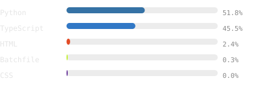

### <samp>Nilaksha Nath</samp>

<samp>CS Student · AI/ML · Full-Stack Developer · Tech Enthusiast</samp>

 

<blockquote>
I’m a Computer Science student passionate about AI/ML, full-stack development,
and building practical technology solutions. I enjoy working on real-world
problems, experimenting with emerging technologies, and turning ideas into
functional products. I’m continuously learning through projects, hackathons,
and hands-on development.
</blockquote>

### <samp>// currently</samp>

<samp>
Building AI-powered applications and exploring LLMs, RAG, local AI, vector
databases, Docker, and intelligent automation, while developing my skills in
full-stack development.
</samp>

 

<samp>
Currently focused on AI engineering, software development, hackathons, and
building impactful real-world projects.
</samp>

### <samp>// activity</samp>

 

<samp>full year</samp>

 

### <samp>// languages</samp>

### <samp>// projects</samp>

|                               |                                                                                                                                       |
| ----------------------------- | ------------------------------------------------------------------------------------------------------------------------------------- |
| **AI Secure Lens**            | AI-powered security and vulnerability analysis platform · [`repo`](https://github.com/Nilakhs/AI-Secure-Lens)                         |
| **Namma Bus**                 | Smart public transportation and bus tracking solution · [`repo`](https://github.com/Nilakhs/Namma-Bus)                                |
| **Stock Prediction**          | Machine-learning based stock trend prediction · [`repo`](https://github.com/Nilakhs/Stock-Prediction)                                 |
| **Industrial Maintenance AI** | AI-powered maintenance, inspection, and automated reporting platform · [`repo`](https://github.com/Nilakhs/Industrial-Maintenance-AI) |

### <samp>// contact</samp>

<samp>
<a href="https://github.com/Nilakhs">github</a> ·
<a href="mailto:nilakshanath1234@gmail.com">email</a>
</samp>

  

This page and its generated graphics are maintained automatically with
<a href="./.github/workflows/refresh.yml">GitHub Actions</a>.
The graphics are generated from scripts in
<a href="./scripts">this repository</a> without third-party
card-generator services.

